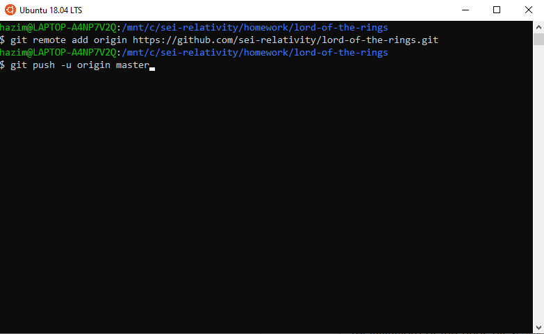

# Uploading react homework
- ##### create new repository in GitHub.

---
- ##### make sure to NOT initialize the README

---
- ##### after creating the repo copy these commands

---
- ##### go to your react project directory and past those commands

---
- ##### copy the link to your GitHub repository and past it in the slack thread.

